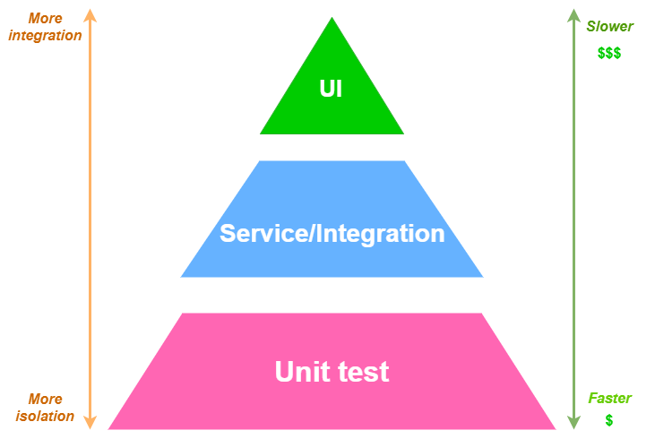

# 3. About testing strategy

Date: 2022-08-20

## Status

Accepted

## Context
To design our testing strategy we are refering to the test pyramid as it follows:

Explanation:
- Most of the tests are unit tests on unitary logic
- Some are integration tests between diferent components of the app.
- Few E2E Tests testing the app from one point to the other (starting at the frontend).

## Decision
We need to add tests to our app. Our testing strategy consists of:
- Testing the controller endpoints with unit and integration tests
- Testing the services with unit tests
- Testing the client calls and library calls with unit tests mocking the third-party APIs and Libraries
- Testing the app end to end

We are going to use code coverage as a measure of quality.

## Consequences

1. Frontend may be hard to test
